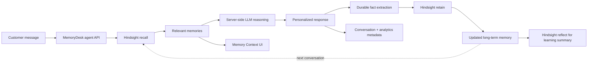

# MemoryDesk AI

> **An AI Support Agent That Remembers Every Customer.**

MemoryDesk AI is a hackathon-ready customer-support workspace built around a simple idea: **normal AI forgets; MemoryDesk AI remembers.** The app demonstrates how a support agent becomes more useful over time because it can retrieve relevant durable context from Hindsight before responding, then retain new facts after the interaction.

## What was built

The product includes a responsive SaaS dashboard, customer directory, conversation history, Hindsight memory workspace, analytics, settings, and a guided Aarav demo. The key demo story is:

1. Aarav reports that his internet disconnects every evening.
2. The agent helps, identifies useful durable context, and retains it in Hindsight.
3. Aarav returns days later and says, “The same issue happened again.”
4. The agent recalls the previous issue, router context, failed restart step, and support preference before generating the next response.
5. The UI makes the improvement visible through Memory Context, Before vs After, Learning Progress, and a Reflect summary.

Live memory success is never simulated. If Hindsight or the LLM is not configured, the UI shows a clear setup/blocker state.

## Why persistent memory matters

A transcript is not the same as memory. Transcripts are complete records of what was said; useful long-term memory is a compact set of durable facts that can be recalled when they matter. A support agent should remember a customer’s device, preferences, recurring problem, previous failed attempts, and successful solutions without sending the full conversation history on every request.

Hindsight is the memory layer in this application. The application repository stores UI metadata and demo analytics; it is not used as a replacement for Hindsight memory.

## Architecture



## Hindsight integration

MemoryDesk uses the current official TypeScript SDK:

```bash
pnpm add @vectorize-io/hindsight-client
```

The server creates `HindsightClient` with `baseUrl` and optional `apiKey` and uses the documented methods:

- `getVersion()` verifies the connection.
- `recall(bankId, query, options)` retrieves relevant memories before the response is generated.
- `retain(bankId, content, options)` stores sanitized durable facts after the interaction.
- `reflect(bankId, query, options)` produces a higher-level synthesis for the Memory page and demo summary.
- `listMemories(bankId, options)` powers the live Memory page when configured.

### Retain flow

After the LLM responds, MemoryDesk extracts durable support facts and removes credential-like strings such as passwords, OTPs, bearer tokens, and API keys. It retains the safe facts with customer tags and a document ID. The UI says **Memory updated** only after the Hindsight retain call succeeds.

### Recall flow

Before the LLM call, the agent queries Hindsight using the customer identity, current issue, device context, support preference, and current message. It passes only normalized, relevant memory items to the LLM. If recall fails or Hindsight is not configured, the agent continues only with an explicit **Memory temporarily unavailable** state; it never pretends that seed data was retrieved from Hindsight.

### Reflect flow

Reflect is used where synthesis is useful: the Memory page and the final Demo Mode step. It asks Hindsight to summarize what has been learned about a customer’s recurring issues, device context, prior attempts, successful solutions, and communication preferences.

### Why Hindsight is more than a normal database

Hindsight is purpose-built for agent memory. Its retain operation extracts facts from natural language, creates embeddings, deduplicates similar facts, recognizes entities, and links related memories. Recall uses multi-strategy retrieval to find contextually relevant memories. Reflect reasons over accumulated memories to produce a higher-level answer. A normal CRUD table can store rows, but it does not provide this memory workflow by itself.

## Tech stack

- Next.js 15 + React 19 + TypeScript
- CSS design system with responsive layouts and accessible controls
- Official `@vectorize-io/hindsight-client`
- OpenAI-compatible LLM API adapter using server-only credentials
- Vitest for server-side workflow tests
- In-memory metadata repository for the hackathon demo, with `DATABASE_URL` reserved as a production persistence seam

## Folder structure

```text
app/
  api/                    Server routes for health, customers, chat, memories, demo, reflect, analytics
  analytics/              Analytics dashboard
  conversations/          Conversation history
  customers/              Customer directory
  demo/                   Guided 10-step hackathon demo
  memory/                 Hindsight memory workspace + graph + reflect
  settings/               Secret-safe integration status
  page.tsx                Main dashboard and chat
  layout.tsx              Global shell and metadata
src/
  components/             App shell and reusable UI primitives
  server/                 Config, repository, sanitization, Hindsight, LLM, agent, demo services
  types.ts                Shared typed contracts
public/
  memorydesk-mark.svg     Project logo/favicon
  manus-routes.json       Web Dev route manifest
```

## Environment setup

Copy the template and fill the server-side values:

```bash
cp .env.example .env.local
```

Required values:

| Variable | Purpose |
| --- | --- |
| `HINDSIGHT_API_URL` | URL of the Hindsight service |
| `HINDSIGHT_API_KEY` | Optional/required according to the Hindsight deployment |
| `HINDSIGHT_BANK_ID` | Memory bank used by MemoryDesk |
| `LLM_API_KEY` | Server-side OpenAI-compatible provider key |
| `LLM_MODEL` | Model name for response generation |
| `LLM_API_URL` | Optional OpenAI-compatible chat-completions URL |
| `DATABASE_URL` | Optional metadata database connection; blank uses demo memory repository |

Never commit `.env`, `.env.local`, or any secret value. The Settings page reports only configured/missing booleans.

## Installation and running locally

```bash
pnpm install
pnpm dev
```

Open `http://localhost:3000`.

Useful checks:

```bash
pnpm typecheck
pnpm lint
pnpm test
pnpm build
```

## Demo instructions

For a live demo, configure Hindsight and an LLM, restart the server, then open **Demo Mode** and click **Run hackathon demo**. The sequence is designed to fit in 60–90 seconds and shows:

- Customer selection and the first report.
- LLM response generation.
- Hindsight retain and the Memory updated state.
- A simulated returning-customer message.
- Hindsight recall and a personalized response.
- Before vs After comparison.
- Reflect-based learning summary.

Without provider credentials, the interface remains usable for inspection, but the live Run Demo action is honestly blocked and Settings explains what is missing.

## Example conversation

**Aarav:** Hi, my internet connection keeps disconnecting every evening.

**Agent:** The first response asks about the router and attempted fixes while retaining useful facts.

**Later, Aarav:** The same issue happened again.

**Agent:** The response is generated with recalled context such as the router model, the restart attempt, the evening pattern, and the next useful troubleshooting step. It does not ask Aarav to start over.

## Security considerations

- Hindsight and LLM calls happen only in server modules/API routes.
- No provider key is imported into client components.
- User text is length-limited and sanitized before display and retention.
- Passwords, OTPs, API keys, bearer tokens, and other credential-like strings are redacted before Hindsight retain.
- API responses use private no-store cache headers.
- Provider error messages are normalized into friendly states; secrets are not logged or echoed.
- Demo seed data is visually labeled and never represented as a successful Hindsight retrieval.

## Testing

The Vitest suite covers:

- Secret redaction and durable-fact extraction.
- Empty-message validation.
- Recall before LLM generation.
- Retain after response generation.
- Hindsight retain failure visibility.
- No fake memory when Hindsight is unconfigured.
- Returning-customer personalization.
- Ordered 10-step demo flow and Reflect.

## Known limitations

- The default metadata repository is in-memory for a frictionless hackathon demo; use a production database adapter for durable application analytics.
- Provider credentials are not included in this workspace, so the live Hindsight/LLM path must be configured before a real memory demo.
- The graph is a UI explanation of the customer story; live memory cards are sourced from Hindsight only when the API returns them.
- Authentication and multi-tenant access controls are not included in this hackathon build.

## Future improvements

- Persist application metadata in PostgreSQL and add authenticated support-team workspaces.
- Add streaming LLM responses and event-by-event Demo Mode playback.
- Add richer Hindsight entity graphs and source chunk inspection for agents.
- Add feedback capture so agents can mark a memory useful or incorrect.
- Add monitoring for retain latency, recall relevance, and memory drift.
